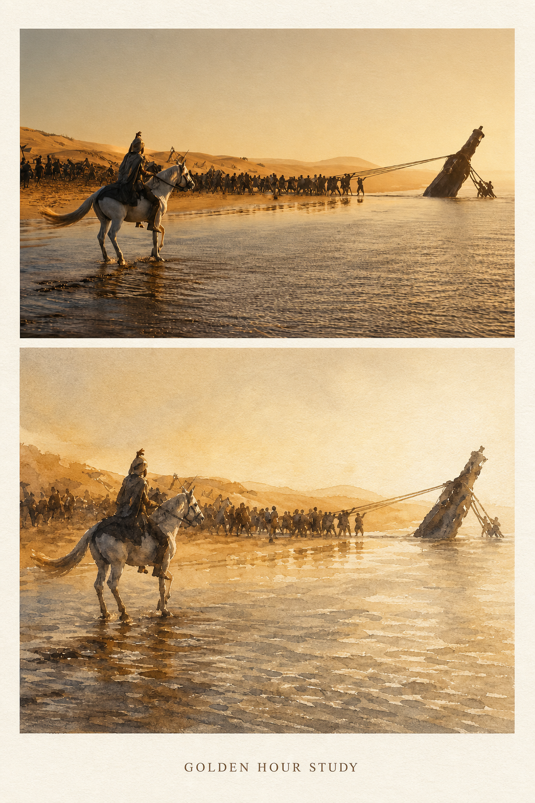
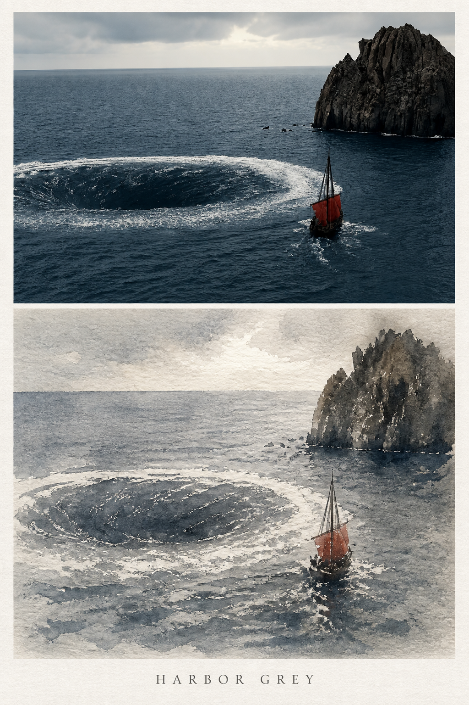

<div align="center">

# Odyssey

**把一张实景照片，变成一页克制、富有光感的水彩旅行画册。**

一个面向 Codex 的图像生成 Skill：保留原始摄影构图，在同一张竖版画布中生成“上半写实摄影 + 下半水彩写生”的双联画册。

`Photo Reference` · `Watercolor Study` · `Vertical Album` · `Codex Skill`

</div>

## 效果预览

<table>
  <tr>
    <td width="33%" align="center"></td>
    <td width="33%" align="center"></td>
    <td width="33%" align="center"></td>
  </tr>
  <tr>
    <td align="center"><sub>GOLDEN HOUR STUDY</sub></td>
    <td align="center"><sub>HARBOR GREY</sub></td>
    <td align="center"><sub>THE WINE-DARK SEA</sub></td>
  </tr>
</table>

## 前后效果对比

左侧为写实参考画面，右侧为 Odyssey 生成的水彩提炼结果。转换过程中会尽量保持主体位置、地平线、山体轮廓和空间关系，同时重新组织明暗、边缘与色彩。

### Golden Hour Study

<table>
  <tr>
    <th width="50%" align="center">Before · 写实参考</th>
    <th width="50%" align="center">After · 水彩写生</th>
  </tr>
  <tr>
    <td align="center"></td>
    <td align="center"></td>
  </tr>
</table>

- 保留骑手、队伍、倒伏雕像与海岸线的位置关系。
- 将金色逆光映射为赭石暖灰，弱化远景细节，让人物和水面高光成为视觉中心。

### Harbor Grey

<table>
  <tr>
    <th width="50%" align="center">Before · 写实参考</th>
    <th width="50%" align="center">After · 水彩写生</th>
  </tr>
  <tr>
    <td align="center"></td>
    <td align="center"></td>
  </tr>
</table>

- 保留漩涡、帆船和右侧礁石构成的三角关系。
- 将海面压入钴蓝灰色域，以断线和纸面留白重建浪花，并保留红帆作为小面积暖色锚点。

### The Wine-Dark Sea

<table>
  <tr>
    <th width="50%" align="center">Before · 写实参考</th>
    <th width="50%" align="center">After · 水彩写生</th>
  </tr>
  <tr>
    <td align="center"></td>
    <td align="center"></td>
  </tr>
</table>

- 保留中心人物、头盔轮廓、水面高度与远山层次。
- 用深蓝灰和生褐统一暗部，通过边缘渗透弱化远山，让头盔金属细节和水面反光保持锐利。

## 项目简介

Odyssey 会分析用户上传照片中的主体、空间层次、光线方向和色彩倾向，并调用当前可用的图像生成能力，输出一张适合收藏、分享或制作旅行画册的竖版作品。

生成结果采用固定的视觉结构：

- **上半区**：保留原始场景布局、主体比例与写实摄影质感。
- **下半区**：将同一场景提炼为低饱和、强明暗、虚实结合的水彩写生。
- **画册纸张**：哑光米白艺术纸底，上下画面之间保留自然留白。
- **英文标题**：底部居中排版，使用 2–4 个英文单词概括场景主题。
- **默认输出**：优先生成 `1024 × 1536`、`2:3` 竖版 PNG。

## 核心特点

- **参考图驱动**：必须使用用户上传的原始照片作为生成参考，而不是脱离原图自由创作。
- **构图连续**：上下两区的海平线、山脊线、建筑轮廓和主体位置保持呼应。
- **光影优先**：强调受光面、深色暗部和锐利高光，让“光”成为画面主角。
- **约式灰色调**：以钴蓝灰、赭石暖灰和生褐中性灰统一画面，避免高饱和堆色。
- **水彩语言明确**：使用湿接湿、边缘渗透、干笔皴擦、纸面留白和大气透视等处理。
- **场景自适应**：史诗场景强化戏剧性和暖色锚点，日常风景保持安静、柔和与克制。
- **文字可靠性**：可先生成无文字画面，再通过后期合成添加标题，降低拼写错误概率。

## 安装

将本仓库克隆或复制到你的 Codex Skills 目录中，并确保目录内保留 `SKILL.md` 与 `agents/openai.yaml`。

```bash
git clone <your-repository-url> ~/.codex/skills/odyssey
```

如果你的 Codex Skills 存放在其他位置，请将目标路径替换为实际目录。安装完成后，重新打开 Codex 或开启一个新任务，让 Skill 被重新发现。

## 使用方法

1. 在 Codex 中上传一张实景照片。
2. 在指令中显式调用 `$odyssey`。
3. 描述希望保留的氛围、色调或标题倾向。
4. 等待生成完成，并从返回的本地路径获取 PNG 文件。

### 基础示例

```text
使用 $odyssey，把这张照片做成上下二分的水彩旅行画册。
上半部分保留原始摄影质感，下半部分生成低饱和水彩写生。
```

### 海景示例

```text
使用 $odyssey 处理这张海岸照片。
整体采用冷灰色调，保留海浪方向和礁石轮廓，
下半区加强湿接湿效果，并留一处小面积暖色作为视觉锚点。
```

### 街景示例

```text
使用 $odyssey 把这张雨后街景制作成竖版画册。
保持建筑透视和人物位置，水彩部分弱化远景细节，
突出路面反光与一处最亮的受光区域。
```

也可以直接使用默认提示：

```text
Use $odyssey to turn this uploaded photo into a Joseph Zbukvic-style
vertical two-part album with a photographic upper panel and a watercolor study below.
```

## 工作流程


具体执行包括：

1. 识别主体景物、建筑轮廓、山体形态、水面走势与空间层次。
2. 判断画面属于史诗／电影感场景，还是日常风景／街景。
3. 将原始色彩映射为统一、低饱和的自然灰色调。
4. 保留上半区摄影结构，并为下半区构建水彩化表达。
5. 使用原图作为 reference image，优先生成 `2:3` 竖版画布。
6. 检查文字准确性，必要时以后期排版方式补充英文标题。
7. 展示生成图片、保存路径，以及本次色调和锚点色说明。

## 视觉原则

Odyssey 的水彩部分重点遵循以下规则：

| 原则 | 表现方式 |
| --- | --- |
| 强烈明暗 | 拉开亮部与暗部，保留明确的视觉焦点 |
| 虚实结合 | 远景和暗部主动晕染，避免处处清晰 |
| 亮部锋利 | 最亮区域同时拥有最清楚的边缘和细节 |
| 松动笔触 | 树冠、灌木、远人使用概括性的碎笔与色点 |
| 水性线条 | 水波、岸线和湿滩使用顺势断线，而非平涂色块 |
| 灰调统一 | 对比主要发生在光线上，而不是依靠鲜艳颜色 |

## 场景处理策略

### 史诗或电影感场景

适用于海洋、风暴、古城、船队、群山等画面。

- 强化逆光、深色剪影和戏剧性明暗关系。
- 允许保留一处小面积暖色作为视觉锚点。
- 通过大气透视弱化远景，突出空间纵深。

### 日常风景或街景

适用于社区、街道、公园、湖边和普通旅行记录。

- 使用柔和漫射光，减少过度戏剧化处理。
- 保持安静克制的整体气质。
- 暖色锚点可根据原图省略，不强行添加新元素。

## 项目结构

```text
Odyssey/
├── SKILL.md                # Skill 行为、约束与完整工作流
├── agents/
│   └── openai.yaml         # Codex 中的名称、简介与默认提示
├── assets/
│   └── comparisons/        # 三组写实参考与水彩结果对比图
├── odyssey-final-8.png     # 示例作品
├── odyssey-final-9.png     # 示例作品
├── odyssey-final-10.png    # 示例作品
└── README.md               # 项目说明
```

## 自定义

你可以直接修改 `SKILL.md` 来调整生成规则，例如：

- 更换默认纸张颜色、上下分区比例或留白大小。
- 改为无标题输出，或指定固定标题格式。
- 调整冷暖灰色调、对比度和视觉锚点策略。
- 增加城市、建筑、山地、海岸等特定场景规则。
- 修改默认尺寸，输出适配小红书、Instagram 或实体印刷的比例。

修改 `agents/openai.yaml` 可以调整 Skill 在 Codex 中显示的名称、简短描述和默认调用提示。

## 内容边界

- 不处理色情、暴力或血腥图片。
- 不擅自新增原图中不存在的人物、车辆、动物或叙事元素。
- 原图中的人物可以保留，但在水彩部分应简化为剪影式笔触，不描绘五官细节。
- 图像生成服务不可用时最多重试 3 次，仍失败则如实返回服务状态。
- 生成式图像可能出现局部结构、细节或文字偏差，正式印刷前建议人工检查。

## 艺术风格说明

本项目用于研究和实践以光影、灰调、湿画法与松动笔触为核心的水彩视觉语言。项目与 Joseph Zbukvic 本人无隶属、合作或官方授权关系，示例与生成结果也不应被表述为艺术家本人创作。

## 参与改进

欢迎通过 Issue 或 Pull Request 提交：

- 新的场景适配规则。
- 更稳定的标题排版方案。
- 更好的构图一致性与参考图约束。
- 不同尺寸、平台和印刷用途的输出模板。
- 使用案例与生成效果对比。

---

<div align="center">

**From photograph to watercolor memory.**

</div>
